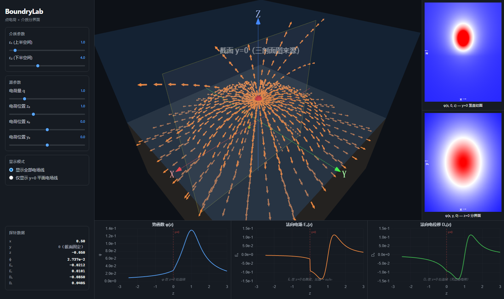
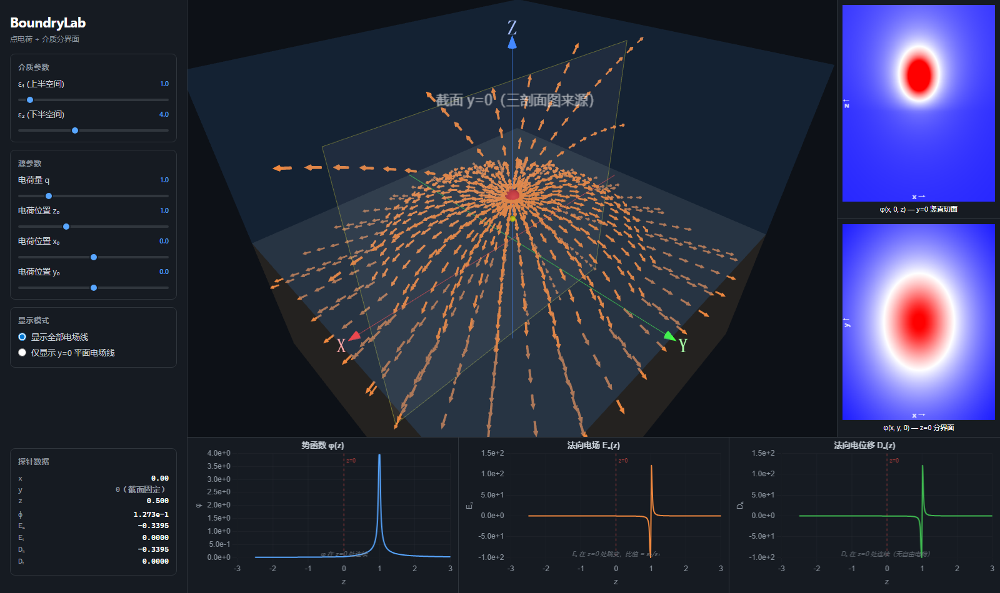
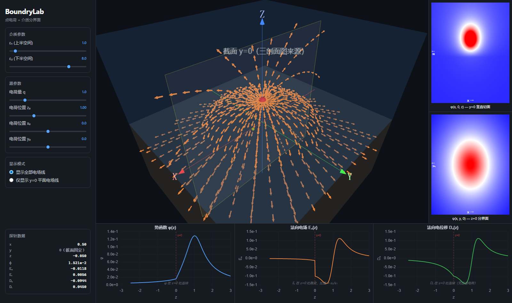
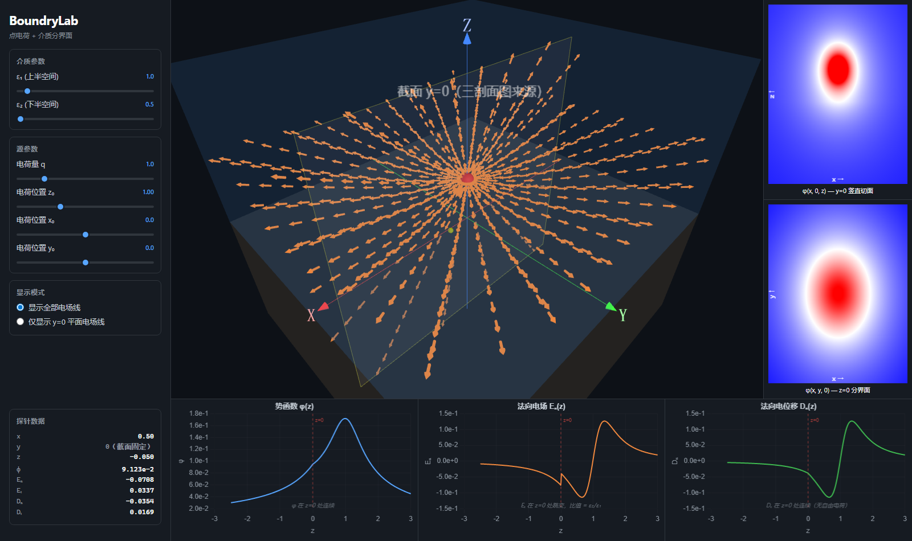
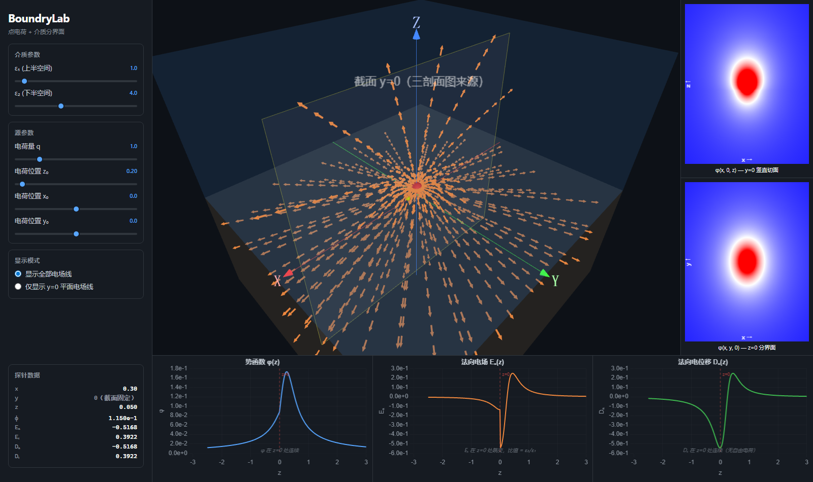
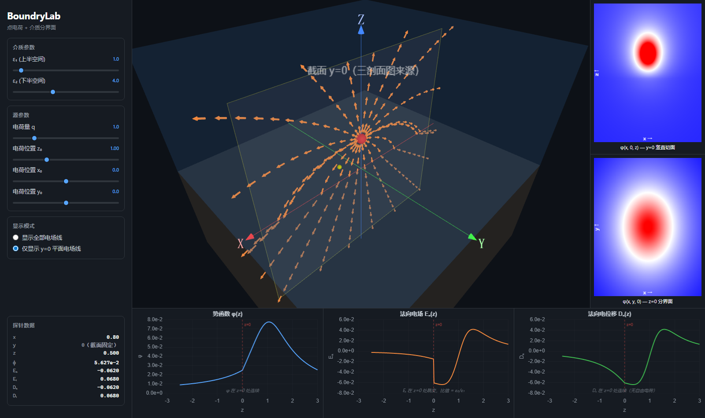

# BoundaryLab 物理规律演示

默认参数：ε₁ = 1.0（上半空间 z>0），ε₂ = 4.0（下半空间 z<0），q = 1.0，电荷位于 (0, 0, 1)。橙色箭头 = 电场 E 场线。

---

## 1. 总览

探针置于 (x=0.5, z≈0) 分界面附近。左侧面板显示探针处的完整场值（x, y=0, z, φ, Eₙ, Eₜ, Dₙ, Dₜ），右上 3D 视图展示全空间电场线（带箭头的小柱体沿场线方向排列，在 z=0 界面处可见弯折），右侧热力图显示 φ(x,0,z) 和 φ(x,y,0)，下方三张剖面图展示 φ(z)、Eₙ(z)、Dₙ(z)。

---

## 2. y=0 截面模式

勾选"仅显示 y=0 平面电场线"后，只展示剖面截面上的场线，与下方三张剖面图的空间位置完全对应。可清晰看到场线在 z=0 分界面处的方向变化。

---

## 3. 势函数 φ 的连续性

**物理规律**：在无自由界面电荷的条件下，势函数 φ 在介质分界面处是**连续**的。

| 探针位置 | φ |
|---------|-----|
| z = +0.05（ε₁ 侧） | ~0.025 |
| z = -0.05（ε₂ 侧） | ~0.025 |

- φ 值几乎相同 → φ 连续。
- 下方 φ(z) 剖面图中，蓝色曲线在 z=0（虚线）处平滑无跳变。

---

## 4. 法向电场 Eₙ 的跳变

**物理规律**：法向电场 Eₙ 在介质分界面处发生**跳变**，跳变比 = ε₂/ε₁。

- 上方 ε₁=1：Eₙ ≈ -0.0740
- 下方 ε₂=4：Eₙ ≈ -0.0185
- **比值 = 4.0 = ε₂/ε₁**

原理：Dₙ = ε·Eₙ 在界面连续，故 ε₁·E₁ₙ = ε₂·E₂ₙ → E₁ₙ/E₂ₙ = ε₂/ε₁。

橙色 Eₙ(z) 剖面图在 z=0 处出现明显跳变。

---

## 5. 法向电位移 Dₙ 的连续性

**物理规律**：Dₙ 在介质分界面处**连续**（∇·D = 0，无自由电荷）。

- 上方：Dₙ ≈ ε₁·E₁ₙ ≈ -0.0740
- 下方：Dₙ ≈ ε₂·E₂ₙ ≈ -0.0740
- 两侧相等 → Dₙ 连续。

绿色 Dₙ(z) 剖面图在 z=0 处平滑无跳变。

---

## 6. 场线折射

**物理规律**：电场线在穿过介质分界面时发生**折射**。从低 ε 侧进入高 ε 侧时，电场线弯向法线。

边界条件：Eₜ 连续、Dₙ 连续 → **tan(θ₁)/tan(θ₂) = ε₁/ε₂**。

### 离轴探针（x=1.2, z=0.3）

橙色场线箭头在 z=0 处明显改变方向——上方（ε₁=1）场线更倾斜，下方（ε₂=4）场线更贴近 z 轴法线。

### 正上方（x=0, z=0.5）

电荷正下方的场线因对称性不弯折（入射角=0，折射角=0）。

---

## 7. 大 ε₂ 对比度（ε₂ = 8）

ε₂/ε₁ = 8 → Eₙ 跳变比 = 8。场线折射更剧烈，进入高 ε 介质后几乎垂直于界面。

---

## 8. ε₂ < ε₁（ε₂ = 0.5）

镜像电荷符号翻转（与真实电荷同号），上方的场被增强而非减弱。下方 |Eₙ| > 上方 |Eₙ|（与 ε₂>ε₁ 相反）。

---

## 9. 电荷靠近分界面（z₀ = 0.2）

镜像电荷位于 (0, 0, -0.2)，与真实电荷几乎对称。场线在界面处剧烈弯折，上方向外扩展、下方汇聚。

---

## 10. y=0 截面 + 默认参数

仅显示剖面截面上的场线，结合下方三张剖面图，清晰展示 φ 连续、Eₙ 跳变、Dₙ 连续三条规律在同一截面上的对应关系。

---

## 物理规律总结

| 物理量 | 在 z=0 处的行为 | 原因 |
|--------|---------------|------|
| φ | **连续** | 势函数定义 |
| Eₜ | **连续** | ∇×E = 0 |
| Eₙ | **跳变**，比值 = ε₂/ε₁ | Dₙ = εEₙ 连续 |
| Dₙ | **连续** | ∇·D = 0（无自由电荷） |
| Dₜ | **跳变**，比值 = ε₂/ε₁ | Eₜ 连续，Dₜ = εEₜ |

以上所有规律均由麦克斯韦方程组在介质分界面处的积分形式导出，并在本系统中得到一致的可视化验证。
